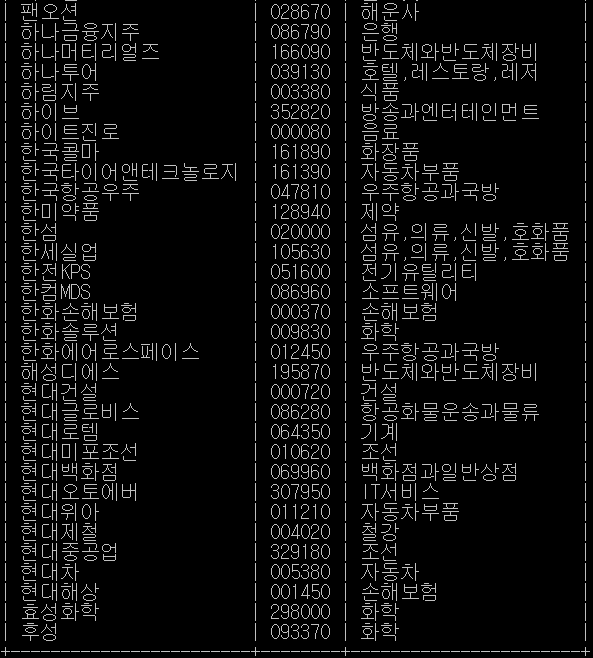
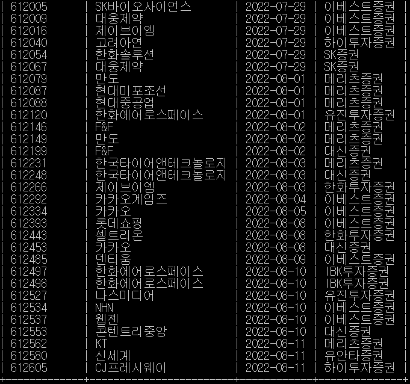
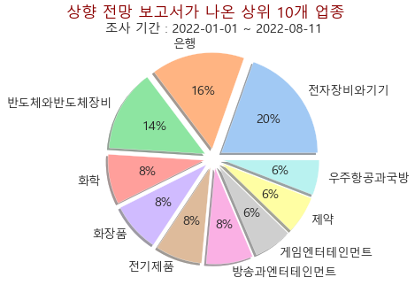
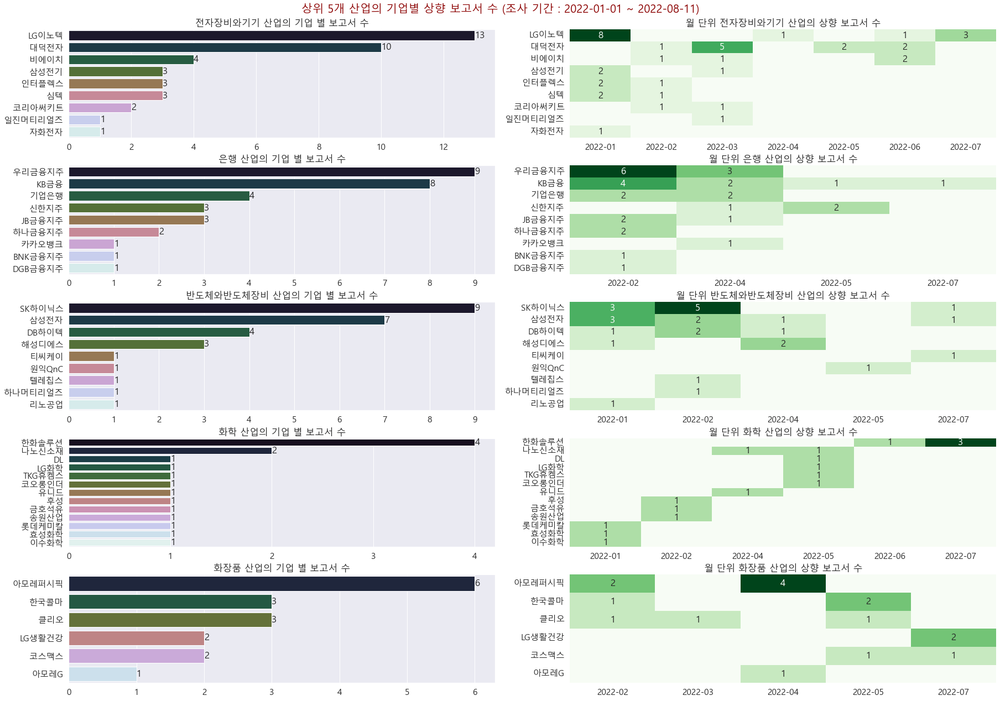

# 한경 컨센서스 웹 스크래핑 & 조회

## 프로젝트 내용
1. 데이터 수집(`main1/DataCollect.ipynb`)
- [한경 컨센서스](http://hkconsensus.hankyung.com/apps.analysis/analysis.list?&skinType=stock_good)에서 나온 상향 데이터 `MySQL`에 수집(`2022-01-01` ~ ) `main1/DataCollect.ipynb`
    - `MySQL`의 접근 ID, PW, DB_NAME 등은 `main1/mysql_info.py`에 별도로 넣을 공간을 만들어뒀습니다.
    - 만드는 테이블은 2개로, `reports` 와 `companies`로 구현했습니다. `main1/mysql.sql`에 테이블을 만드는 쿼리를 적어뒀습니다.

2. 수집 결과(`main1/DataProcessing.ipynb`)
    1. `companies` 테이블  
      

    2. `reports` 테이블  
      

- 수집된 데이터를 바탕으로 n주일 전부터 오늘까지의 데이터를 취합 & 산업과 기업별로 시각화 : `main1/DataProcessing.ipynb`
    - 1. 산업별 시각화  
        
    - 2. 기업별 시각화  
        

## 개요
- "상향 보고서가 많이 나온 업종의 대표 기업은 주가가 오를 가능성이 크지 않을까?" 라는 모 커뮤니티 사이트에서 본 아이디어를 바탕으로 만들었습니다.  
- 프로젝트 진행 과정과 시행착오는 `progress.md`에 기록해두었습니다.

## 필요
- [MySQL 커뮤니티 버전](https://dev.mysql.com/downloads/mysql/)
- [크롬 드라이버](https://chromedriver.chromium.org/downloads)
- 패키지는 `requirements.txt` 참조

### 기타 등등..
- 프로젝트 진행 기간 : `220803 ~ 220811`
